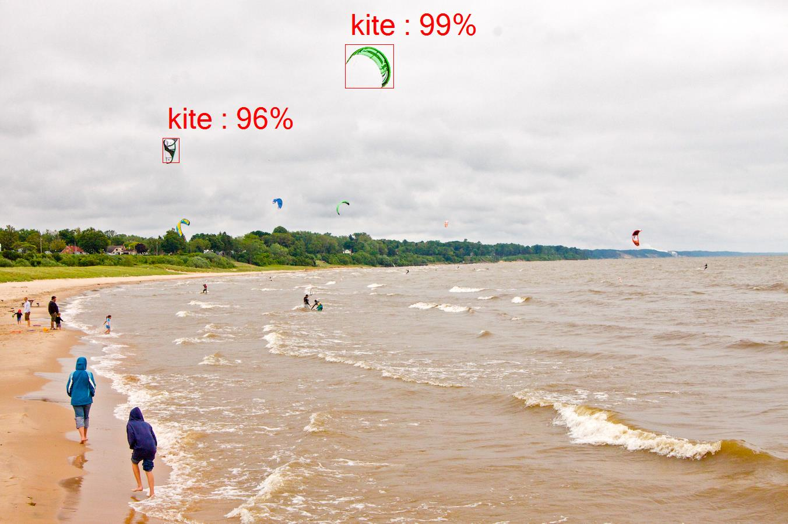

# Object Detection Example #

This example uses tensorflow [object detection model API](https://github.com/tensorflow/models/tree/master/object_detection) and TensorFlowSharp library to identify multiple objects in a single image using .NET programming languages like C# and F#.

## Run example on Windows ##
1. git clone https://github.com/migueldeicaza/TensorFlowSharp
2. build TensorFlowSharp.sln in Debug configuration
3. copy 'libtensorflow.dll' to 'TensorFlowSharp\Examples\ExampleObjectDetection\bin\Debug' folder (see where you can get the library under [Working on TensorFlowSharp](https://github.com/migueldeicaza/TensorFlowSharp#working-on-tensorflowsharp) section)
4. go to 'TensorFlowSharp\Examples\ExampleObjectDetection' folder and run 'run_example_windows.ps1' PowerShell script. This step detects objects in the 'TensorFlowSharp\Examples\ExampleObjectDetection\test_images\input.jpg' image and saves result to 'TensorFlowSharp\Examples\ExampleObjectDetection\bin\Debug\test_images\output.jpg' image.

## Run example on Mac OS ##
1. git clone https://github.com/migueldeicaza/TensorFlowSharp
2. build TensorFlowSharp.sln with Debug configuration using,for instance, Visual Studio for Mac
3. copy 'libtensorflow.dylib' to 'TensorFlowSharp\Examples\ExampleObjectDetection\bin\Debug' folder  (see where you can get the library under [Working on TensorFlowSharp](https://github.com/migueldeicaza/TensorFlowSharp#working-on-tensorflowsharp) section)
4. go to 'TensorFlowSharp\Examples\ExampleObjectDetection' folder and run 'run_example_macos.sh'. This step detects objects in the 'TensorFlowSharp\Examples\ExampleObjectDetection\test_images\input.jpg' image and saves result to 'TensorFlowSharp\Examples\ExampleObjectDetection\bin\Debug\test_images\output.jpg' image.

## I found an issue in the example ##
If you want to address a bug or a question related to the object detection example, just create new issue on github starting with [Object Detection Example] tag.